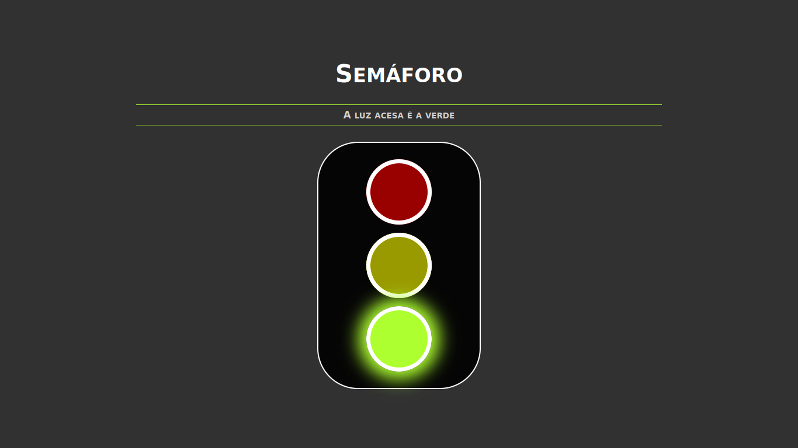
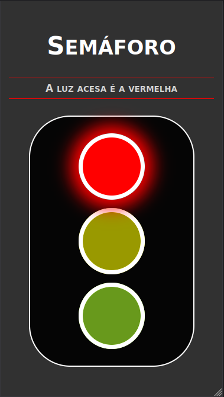
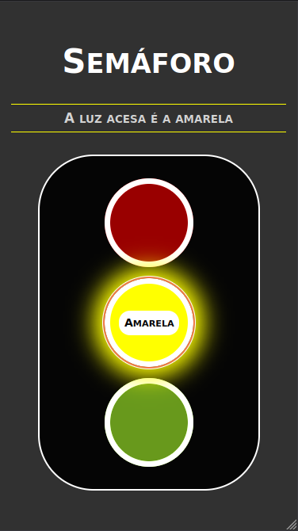
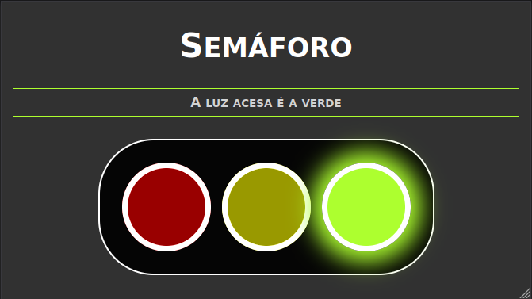

# :vertical_traffic_light: Semáforo

Este projeto apresenta um sistema de luzes de trânsito, baseado na dinâmica de um semáforo.

Uma única luz é acesa de cada vez. As luzes são trocadas automaticamente a cada 5 segundos, porém o usuário pode escolher outra para acender a qualquer momento, selecionando-a.

Uma informação é apresentada sobre qual é a cor que está acesa no momento. A aplicação pode ser facilmente adaptada para receber mais luzes ou alterar o conjunto de cores.

Tendo em vista uma experiência com acessibilidade, cada luz apresenta seu respectivo nome ao ser selecionada. Sua escolha pode ser feita através do mouse ou via teclado com as teclas Tab e Enter.

## :gear: Tecnologias

- HTML
- CSS
- JavaScript
- React

## :art: Layout

